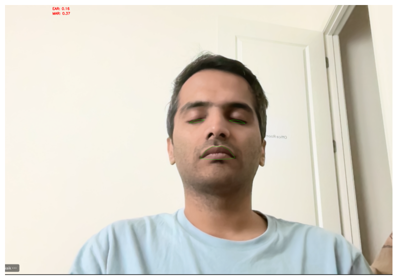
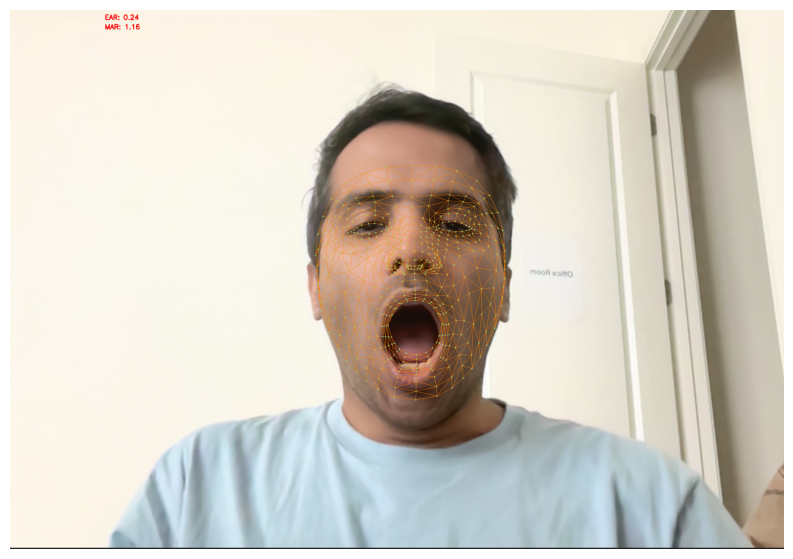
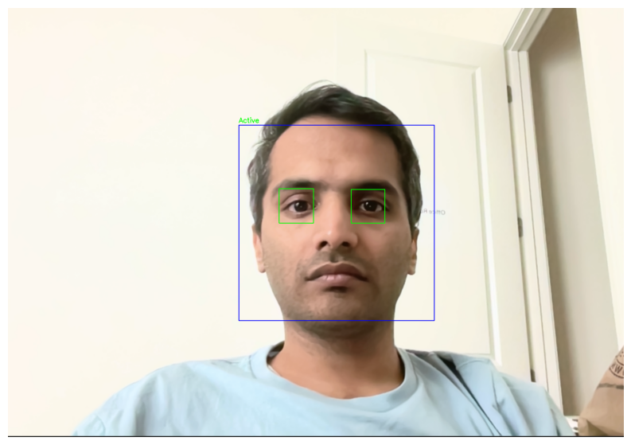
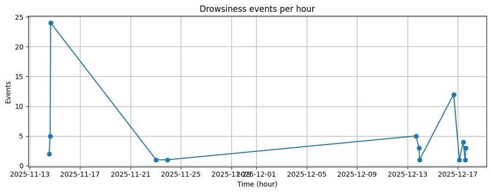

# Driver Drowsiness Alert System

This project is a real-time driver drowsiness detection system that uses computer vision to prevent accidents caused by driver fatigue. It analyzes a driver's facial landmarks from a webcam feed to detect signs of drowsiness, such as closed eyes and yawning, and issues an alert.

## Clone the repository

Clone the repository (SSH):

```bash
git clone git@github.com:kednaik/Driver-Drowsiness-Detection.git
cd Driver-Drowsiness-Detection
```

## Environment setup

Create and activate a Python virtual environment and install dependencies (macOS / zsh):

```bash
python3 -m venv .venv
source .venv/bin/activate
pip install -r requirements.txt
```

Notes:

After activating the virtual environment, open `main.ipynb` in Jupyter or VS Code, select the `.venv` kernel / interpreter (`.venv/bin/python`), and run the notebook cells to run the demo sections (Dlib, MediaPipe, CNN). When running cell first time if prompted install

## Features

- **Real-time Drowsiness Detection:** Monitors the driver's face using a webcam.
- **Eye Aspect Ratio (EAR) Calculation:** Detects eye closure by calculating the EAR.
- **Yawn Detection:** Monitors the Mouth Aspect Ratio (MAR) to detect yawns.
- **Audible Alerts:** Plays an alarm sound when drowsiness is detected.
- **Event Logging:** Logs all drowsiness and yawn events to a CSV file for later analysis.

## Problem & Solution

1. Problem: Drivers can fall asleep or lose attention while driving, which
    increases the risk of accidents. The project detects two primary visual
    cues of drowsiness: prolonged eye closure and yawning, using a webcam
    feed.

2. Signals & Models: The program extracts diagnostic signals — Eye Aspect
    Ratio (EAR) and Mouth Aspect Ratio (MAR) — from facial landmarks (dlib
    or MediaPipe). Optionally, a CNN classifier operates on cropped mouth/eye
    ROIs to produce complementary predictions when landmark-based cues are
    ambiguous.

3. Processing Pipeline: Frames are captured from the camera, faces are
    detected, and either dense landmarks or Haar-based ROIs are used to
    compute EAR/MAR or produce CNN inputs. Frame-level outputs are smoothed
    through short-term counters to reduce false positives.

4. Action & Feedback: When aggregated metrics indicate drowsiness, the
    system plays an audible alarm, overlays status annotations on the video
    frame, and logs the event (CSV + optional screenshot) for audit and
    analysis.

5. Design & Extensibility: Analyzer logic is modular (`BaseAnalyzer`,
    `DlibAnalyzer`, `MediapipeAnalyzer`, CNN wrapper). Utilities centralize
    EAR/MAR, logging, and alarm playback so components can be swapped,
    tested with lightweight stubs, or integrated into the Jupyter demo or
    Streamlit UI.

# Driver Drowsiness Alert System

Brief: A real-time driver drowsiness detection toolkit that uses computer
vision and lightweight classifiers to detect closed eyes and yawning from
webcam frames and trigger alerts. The repository includes three analyzer
implementations (dlib landmarks, MediaPipe Face Mesh, and a CNN-based
classifier), utility helpers, a Jupyter demo notebook, a Streamlit UI,
and tests.

Repository (GitHub): https://github.com/your-username/driver-drowsiness-detection

Replace the URL above with your repository URL.

---


Project Structure (matches the notebook sections)

```
driver-drowsiness-detection/
├── drowsiness/               # core analyzers and helpers
│   ├── __init__.py
│   ├── base_analyzer.py       # shared detection/overlay + BaseAnalyzer
│   ├── face_detector.py      # face detector abstraction (dlib/mediapipe helpers)
│   ├── dlib_analyzer.py      # dlib-based analyzer (EAR/MAR)
│   ├── mediapipe_analyzer.py # MediaPipe-based analyzer (Face Mesh)
│   ├── cnn_analyzer.py       # CNN-based detector / wrapper
│   ├── cnn_trainer.py        # Trainer and model building utilities
│   ├── cnn_utils.py          # helpers for ROI extraction and preprocessing
│   └── utils.py               # Utility functions (EAR, MAR, logging, alarms)
├── data/                     # optional datasets (yawn/open/closed)
├── models/                   # pretrained models (dlib predictor, CNN .h5)
├── logs/                     # event logs and screenshots
├── alarm/                    # alarm sound files
├── prediction_output/        # example annotated outputs (images)
├── main.ipynb                # interactive Jupyter demo (notebook)
├── requirements.txt
├── scripts/                  # helper scripts and developer utilities
│   ├── setup_venv.sh         # create venv and install requirements
│   ├── run_streamlit_venv.sh # helper to run streamlit inside the repo venv
│   └── run_tests.sh          # convenience wrapper to run pytest
├── tests/                    # pytest unit tests and test utilities
│   ├── conftest.py           # test-time mocks + PYTHONPATH helper
│   ├── test_utils_functions.py
│   ├── test_drowsiness.py
│   ├── test_ui_overlay.py
│   └── test_base_analyzer.py # added unit tests for BaseAnalyzer
└── README.md
```

# Table of Contents

1. Drowsiness Detection (dlib landmarks)
2. Drowsiness Detection (MediaPipe Face Mesh)
3. Drowsiness Detection (CNN classifier)
4. Log analysis demo
5. Bonus: Streamlit web application

---

# 1) Drowsiness Detection — Dlib landmarks

Short: Classic EAR/MAR thresholding using `dlib` 68-point landmarks. This
is lightweight and works well when the driver's face is approximately
frontal to the camera.

How to run (notebook): open `main.ipynb` and run the Dlib section cells.

Example output:



---

# 2) Drowsiness Detection — MediaPipe Face Mesh

Short: Uses MediaPipe Face Mesh to obtain dense facial landmarks and
computes EAR/MAR from the mesh coordinates. More robust to moderate head
pose and lighting variations than the dlib landmarks approach.

How to run (notebook): open `main.ipynb` and run the MediaPipe section
cells.

Example output:



---

# 3) Drowsiness Detection — CNN classifier

Short: A CNN-based classifier that predicts mouth/eye states from cropped
ROIs (mouth and eyes). Useful in controlled settings or as a second
signal combined with landmark-based heuristics.

How to run (notebook): open `main.ipynb` and run the CNN section cells.

### Preprocessing for Yawn Detection

To improve the accuracy of yawn detection, the system preprocesses the input images (both for training and real-time prediction) by focusing on the mouth region:

1.  **Face Detection:** The system first detects the face using OpenCV's `haarcascade_frontalface_default.xml`.
2.  **Mouth Cropping:**
    - It attempts to detect the mouth within the lower half of the face using `haarcascade_smile.xml`.
    - If a smile/mouth is detected, it crops that specific region.
    - If no specific mouth region is detected (which can happen with wide yawns), it falls back to cropping the entire lower half of the face.
3.  **Resizing:** The cropped mouth image is then resized to 145x145 pixels before being fed into the CNN model.

This ensures that the model learns features specific to the mouth shape (open vs. closed) rather than irrelevant facial features.

**Caveat about the CNN method:**

- The CNN-based approach in this project relies heavily on reliably detecting and cropping the eyes/mouth regions before prediction. In practice this means the CNN's accuracy is sensitive to the face/eye/mouth detection step, lighting, occlusion, and how well the mouth/eye ROI is cropped and resized.
- Because of this dependency, the CNN method can be less effective in uncontrolled live webcam scenarios compared to EAR/MAR thresholding with robust landmark detectors (dlib or MediaPipe). Use the CNN for controlled image classification or as a complement to landmark-based methods rather than as a standalone, drop-in replacement for real-time detection.


Example output:



---

# 4) Log analysis demo

Short: Analyze previously logged drowsiness events stored in
`logs/drowsiness_log.csv`. The tools print summaries, plot timelines, and
display thumbnails of logged events.

How to run (notebook): open `main.ipynb` and run the Logs Analysis cells.

Example output (log summary / thumbnail):



---

# 5) Bonus: Streamlit web application

Short: A Streamlit-based UI that demonstrates the three detection modes,
live webcam preview, and recent events. Start the app using the helper
script in `scripts/` or run Streamlit with the `.venv` Python.

How to run (quick):

```bash
# with venv activated
bash ./scripts/run_streamlit_venv.sh
# or
.venv/bin/python -m streamlit run app.py
```

Open http://localhost:8501 in your browser.


## Testing
Run the test suite with `pytest`. Recommended workflow when using the project's virtual environment:

```bash
# activate the venv (macOS / Linux zsh)
source .venv/bin/activate

# (optional) ensure dev/test dependencies are installed
pip install -r requirements.txt

# run the full test suite
pytest

# run tests with more output (verbose)
pytest -q

# run a single test file
pytest tests/test_utils_logging.py

# run a single test function
pytest tests/test_utils_logging.py::test_log_event
```

Notes:
- If you created the virtual environment using `scripts/setup_venv.sh`, activate it with `source .venv/bin/activate` before running tests.
- On macOS with Apple Silicon you may need to install platform-specific packages (for example `tensorflow-macos` / `tensorflow-metal`) in the venv before running model-related tests.
- If a test requires hardware (webcam) or audio output, run it manually while the venv is active.

Running tests via helper script

We provide a small helper script to make running the test suite convenient. The script will activate the project's `.venv` (if present), add the project root to `PYTHONPATH`, and run `pytest`.

Usage:
```bash
# run default (quiet) test run
bash scripts/run_tests.sh

# pass pytest args through (verbose)
bash scripts/run_tests.sh -q

# make it executable then run
chmod +x scripts/run_tests.sh
./scripts/run_tests.sh
```

Notes:
- The script is a convenience wrapper; you can still activate the venv yourself and run `pytest` directly if you prefer.
- The script sets `PYTHONPATH` so tests can import `drowsiness` from the project root.
